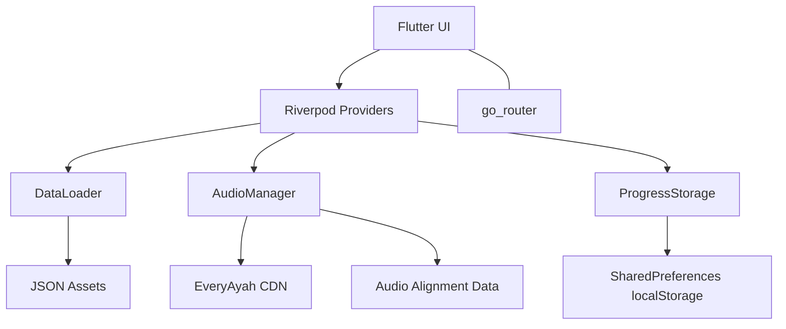

# Executive Overview

## What This Project Does

Quranic Vocabulary App is a Flutter web application that teaches Quranic Arabic vocabulary using a word-by-word reader and spaced repetition. Defined in: `quran_vocab/README.md`.

## Who It Is For

The primary audience is learners who can read Arabic script but want to understand Quranic vocabulary through structured practice. Defined in: `HANDOFF.md`.

## Core Capabilities

- Read the Quran by surah with word-by-word display and English translation per ayah. Defined in: `quran_vocab/lib/presentation/views/reader_view.dart`, `quran_vocab/lib/presentation/widgets/ayah_widget.dart`.
- Tap a word to see details and root information when available. Defined in: `quran_vocab/lib/presentation/widgets/word_detail_popup.dart`, `quran_vocab/lib/presentation/state/quran_providers.dart`.
- Spaced repetition review using FSRS. Defined in: `quran_vocab/lib/services/srs/fsrs.dart`, `quran_vocab/lib/presentation/views/review_view.dart`.
- Curriculum and lesson view scaffolding. Defined in: `quran_vocab/lib/presentation/views/curriculum_view.dart`, `quran_vocab/lib/presentation/views/lesson_detail_view.dart`, `quran_vocab/assets/data/lessons.json`.
- Audio playback per ayah with optional word highlighting using alignment data. Defined in: `quran_vocab/lib/services/audio/audio_manager.dart`, `quran_vocab/lib/data/audio_alignment_loader.dart`, `quran_vocab/assets/data/audio_align/Alafasy_128kbps.json`.
- IndoPak vs Uthmani script toggle. Defined in: `quran_vocab/lib/presentation/state/settings_providers.dart`, `quran_vocab/lib/presentation/widgets/word_chip.dart`.

## Non-Goals

- No backend API or server-side services are present in this repository. Defined in: repository tree `docs/01-repository-map.md`.
- No user authentication or multi-device sync. Defined in: `quran_vocab/lib/services/storage/progress_storage.dart`.
- No production deployment pipeline is defined in the repo. Defined in: absence of CI config in repository root.

## Tech Stack Summary

| Layer | Tech | Evidence |
| --- | --- | --- |
| App runtime | Flutter web | `quran_vocab/lib/main.dart`, `quran_vocab/pubspec.yaml` |
| Language | Dart | `quran_vocab/pubspec.yaml` |
| State management | Riverpod | `quran_vocab/lib/presentation/state/*` |
| Routing | go_router | `quran_vocab/lib/presentation/routes/app_router.dart` |
| Audio | just_audio | `quran_vocab/lib/services/audio/audio_manager.dart`, `quran_vocab/pubspec.yaml` |
| Persistence | shared_preferences (localStorage on web) | `quran_vocab/lib/services/storage/progress_storage.dart` |
| Data store | JSON assets bundled with app | `quran_vocab/lib/data/data_loader.dart`, `quran_vocab/assets/data/*` |
| Optional DB layer | sqflite + schema (not wired into runtime) | `quran_vocab/lib/data/db/quran_database.dart`, `quran_vocab/lib/data/db/quran_dao.dart` |
| Fonts | Google Fonts Amiri, local Lateef | `quran_vocab/lib/presentation/theme/app_theme.dart`, `quran_vocab/pubspec.yaml` |

## High-Level Architecture Diagram

Defined in: `quran_vocab/lib/presentation/views/*`, `quran_vocab/lib/presentation/state/*`, `quran_vocab/lib/data/data_loader.dart`, `quran_vocab/lib/services/audio/audio_manager.dart`, `quran_vocab/lib/data/audio_alignment_loader.dart`, `quran_vocab/lib/services/storage/progress_storage.dart`.

## Related Docs

- [Repository Map](01-repository-map.md)
- [Architecture](02-architecture.md)
- [Local Development](03-local-development.md)
