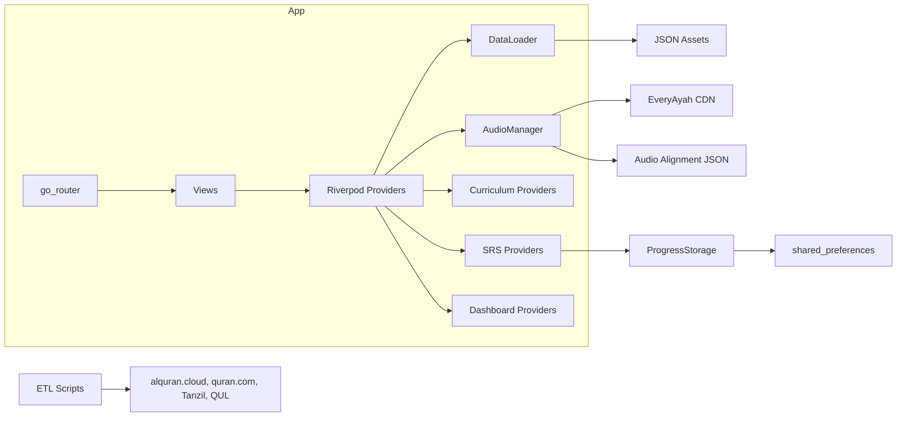
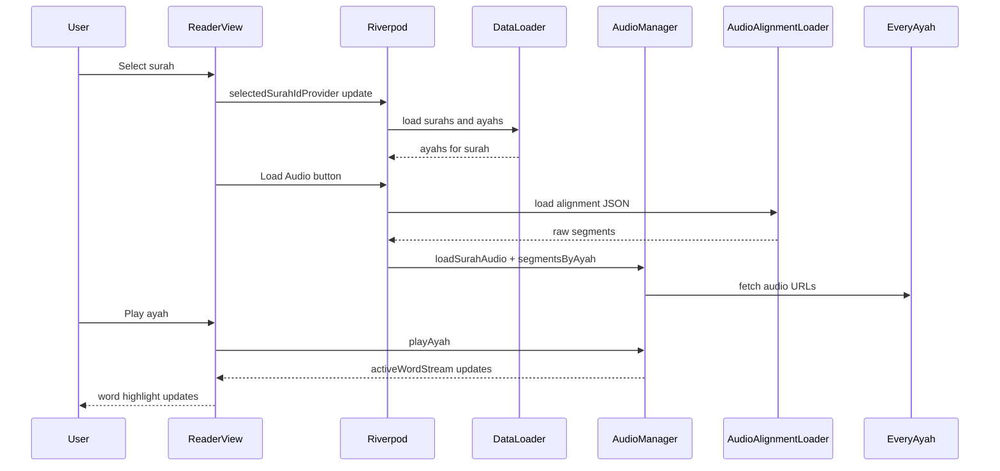

# Architecture and Component Mapping

## Component Inventory

| Component | Purpose | Key Responsibilities | Interfaces | Dependencies | Runtime | Config or Env | Failure Modes | Evidence |
| --- | --- | --- | --- | --- | --- | --- | --- | --- |
| Flutter UI | Render screens and interactions | Surah list, reader, review, curriculum, settings, dashboard | go_router routes, Riverpod providers | Flutter, Material 3 | Browser | None found | Widget build errors, data load failures | `quran_vocab/lib/presentation/views/*`, `quran_vocab/lib/presentation/routes/app_router.dart` |
| DataLoader | Load Quran data from assets | Parse JSON into models and build lookup maps | `surahs`, `ayahs`, `words`, `roots` getters | Flutter asset bundle, JSON | In-memory | Asset file paths | Missing assets or bad JSON | `quran_vocab/lib/data/data_loader.dart`, `quran_vocab/assets/data/*` |
| AudioAlignmentLoader | Load alignment data | Build word-level segments from raw segments | `buildSegmentsForAyah` | Audio alignment JSON | In-memory | Asset file path | Missing alignment data, wrong word counts | `quran_vocab/lib/data/audio_alignment_loader.dart`, `quran_vocab/assets/data/audio_align/Alafasy_128kbps.json` |
| AudioManager | Playback and highlight timing | Load ayah or surah audio, emit active word IDs | `loadSurahAudio`, `playAyah`, `activeWordStream` | just_audio, EveryAyah CDN | Browser | Audio offset, CDN URL | Network failures, misaligned segments | `quran_vocab/lib/services/audio/audio_manager.dart` |
| SRS Engine | Spaced repetition scheduling | Compute next interval and difficulty | `FSRS.review` | Dart math | In-memory | None | Incorrect scheduling if parameters changed | `quran_vocab/lib/services/srs/fsrs.dart` |
| ProgressStorage | Persist progress | Save and load user progress and streak | `load`, `upsert`, `updateStreakOnReview` | shared_preferences | Browser localStorage | Keys are constants | Storage read errors, reset data | `quran_vocab/lib/services/storage/progress_storage.dart` |
| Curriculum | Lesson scaffolding | Load lesson JSON, track completion, unlock order | `curriculumProvider`, `lessonUnlockedProvider` | JSON assets | In-memory | Asset file path | Missing lessons JSON | `quran_vocab/lib/presentation/state/curriculum_provider.dart`, `quran_vocab/assets/data/lessons.json` |
| SQLite Layer (optional) | Future data persistence | Schema and DAO for SQL | `QuranDatabase.open`, `QuranDao` | sqflite | Not wired in runtime | DB name | Schema drift | `quran_vocab/lib/data/db/quran_database.dart`, `quran_vocab/lib/data/db/quran_dao.dart` |
| ETL Scripts | Build or validate datasets | Download, validate, build DB | CLI scripts | Python 3, external APIs | Local CLI | None | API outages, rate limits | `tools/etl/*.py` |

## Component Diagram

Defined in: `quran_vocab/lib/presentation/routes/app_router.dart`, `quran_vocab/lib/presentation/views/*`, `quran_vocab/lib/presentation/state/*`, `quran_vocab/lib/data/data_loader.dart`, `quran_vocab/lib/services/audio/audio_manager.dart`, `quran_vocab/lib/data/audio_alignment_loader.dart`, `quran_vocab/lib/services/storage/progress_storage.dart`, `tools/etl/*.py`.

## End-to-End Flow (Reader + Audio)

Defined in: `quran_vocab/lib/presentation/views/reader_view.dart`, `quran_vocab/lib/presentation/state/audio_providers.dart`, `quran_vocab/lib/data/audio_alignment_loader.dart`, `quran_vocab/lib/services/audio/audio_manager.dart`.

## Config and Environment

No environment variables are defined in code. Verification steps:

- Search for `fromEnvironment` or `.env` usage. Defined in: `quran_vocab/lib/*`.
- Search for `dotenv` or config loaders. Defined in: repository root.

## Failure Modes and Mitigations

- Missing or malformed JSON assets will block loading. Mitigation: re-run ETL and validate JSON in `assets/data/`. Defined in: `quran_vocab/lib/data/data_loader.dart`, `tools/etl/validate_quran_text.py`.
- Audio alignment mismatch can cause incorrect highlighting. Mitigation: validate alignment data and word boundaries. Defined in: `quran_vocab/lib/data/audio_alignment_loader.dart`, `tools/etl/validate_words.py`.
- CDN audio failures will block playback. Mitigation: check connectivity and verify EveryAyah URLs. Defined in: `quran_vocab/lib/services/audio/audio_manager.dart`.

## Retries and Timeouts

- ETL downloads use timeouts and retries with exponential backoff. Defined in: `tools/etl/download_quran_data.py`.
- Runtime audio playback does not implement explicit retries. Defined in: `quran_vocab/lib/services/audio/audio_manager.dart`.

## Change Impact Matrix

| Change | Likely Impact | Tests to Run | Deploy or Rebuild | Evidence |
| --- | --- | --- | --- | --- |
| Update `words_full.json` schema | DataLoader parsing and word display | `flutter test` | Rebuild web bundle | `quran_vocab/lib/data/data_loader.dart`, `quran_vocab/assets/data/words_full.json` |
| Modify audio alignment JSON | Word highlighting timing | `flutter test` | Rebuild web bundle | `quran_vocab/lib/data/audio_alignment_loader.dart`, `quran_vocab/assets/data/audio_align/Alafasy_128kbps.json` |
| Update SRS logic | Review scheduling and progress | `flutter test` | Rebuild web bundle | `quran_vocab/lib/services/srs/fsrs.dart` |
| Change theme or typography | Visual UI regressions | `flutter test` and manual UI check | Rebuild web bundle | `quran_vocab/lib/presentation/theme/app_theme.dart` |
| Adjust schema in SQLite layer | Potential future DB migrations | No runtime tests in current app | Rebuild if DB is used | `quran_vocab/lib/data/db/quran_database.dart` |

## Related Docs

- [Data and Storage](06-data-storage.md)
- [API and Interfaces](07-api-interfaces.md)
