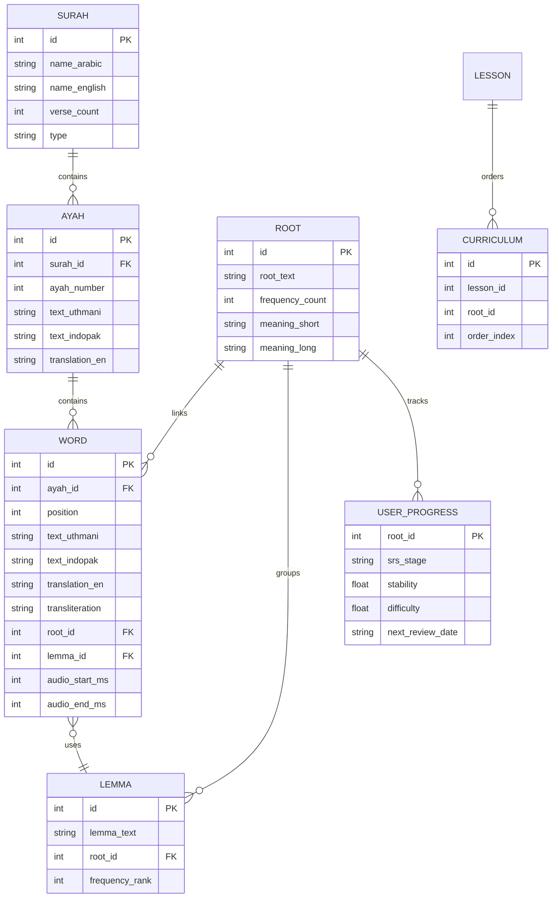

# Data and Storage

## Data Stores

| Store | Purpose | Location | Persistence | Evidence |
| --- | --- | --- | --- | --- |
| JSON assets | Quran text, words, roots, lessons | `quran_vocab/assets/data/*` | Bundled with app | `quran_vocab/lib/data/data_loader.dart` |
| Audio alignment JSON | Word timing alignment | `quran_vocab/assets/data/audio_align/Alafasy_128kbps.json` | Bundled with app | `quran_vocab/lib/data/audio_alignment_loader.dart` |
| Local storage | User progress and streak | Browser localStorage via shared_preferences | User device | `quran_vocab/lib/services/storage/progress_storage.dart` |
| SQLite schema (optional) | Future persistence | `quran_vocab/lib/data/db/quran_database.dart` | Not wired into runtime | `quran_vocab/lib/data/db/quran_database.dart` |

## Data Files and Shapes

| File | Contents | Notes | Evidence |
| --- | --- | --- | --- |
| `quran_vocab/assets/data/surahs.json` | Surah metadata | Loaded into `Surah` model | `quran_vocab/lib/data/data_loader.dart` |
| `quran_vocab/assets/data/ayahs_full.json` | All ayahs with Uthmani and IndoPak text | IndoPak may be updated by script | `quran_vocab/lib/data/data_loader.dart`, `tools/etl/download_indopak.py` |
| `quran_vocab/assets/data/words_full.json` | Word-by-word data | Used for word display and search | `quran_vocab/lib/data/data_loader.dart` |
| `quran_vocab/assets/data/roots.json` | Root metadata | Used in word detail popup | `quran_vocab/lib/data/data_loader.dart` |
| `quran_vocab/assets/data/lessons.json` | Curriculum | Loaded into `Unit` and `Lesson` models | `quran_vocab/lib/presentation/state/curriculum_provider.dart` |

## ERD (Relational Schema)

Defined in: `quran_vocab/lib/data/db/quran_database.dart`, `docs/schema.md`.

## Data Generation and Validation

- Download primary JSON: `python3 tools/etl/download_quran_data.py`. Defined in: `tools/etl/download_quran_data.py`.
- Update IndoPak text: `python3 tools/etl/download_indopak.py`. Defined in: `tools/etl/download_indopak.py`.
- Validate Uthmani text vs QUL: `python3 tools/etl/validate_quran_text.py`. Defined in: `tools/etl/validate_quran_text.py`.
- Validate word-by-word data vs quran.com API: `python3 tools/etl/validate_words.py`. Defined in: `tools/etl/validate_words.py`.

## Data Lifecycle and Retention

- JSON assets are bundled and shipped with the Flutter web build. Defined in: `quran_vocab/pubspec.yaml`.
- User progress persists in localStorage on the client only. Defined in: `quran_vocab/lib/services/storage/progress_storage.dart`.
- No backup or retention policy is defined in the repo. Marked as Unknown.

## Raw Downloads

- `indopakjsons/` contains raw IndoPak word data downloads used for data preparation, not runtime. Defined in: `indopakjsons/*`.
- `data/raw/` is used by ETL scripts for source files and is gitignored. Defined in: `tools/etl/README.md`, `.gitignore`.
